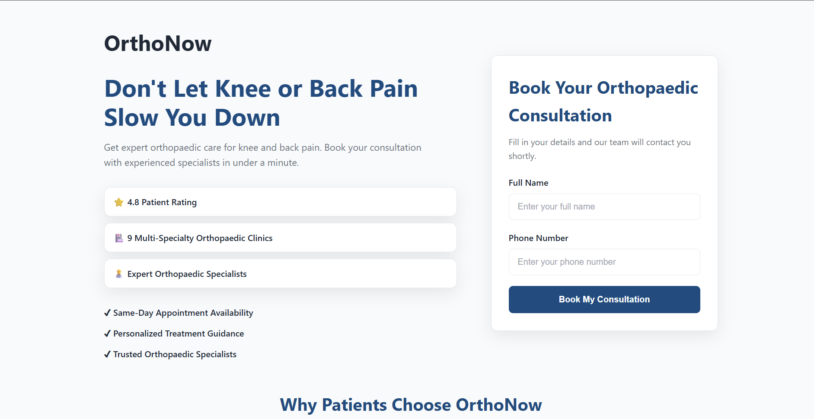
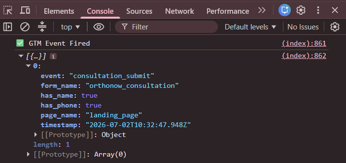
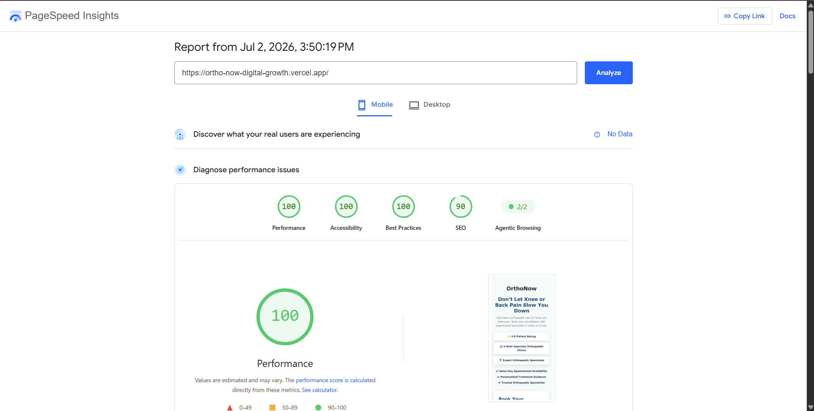

# OrthoNow Digital Growth Assignment

This repository contains my submission for the OrthoNow Digital Growth Developer Assignment.

The assignment covers three areas:

- Designing a Google Tag Manager (GTM) event tracking plan
- Building a responsive landing page
- Proposing an integration design for analytics, CRM, and WhatsApp communication

---

# Repository Structure

```
.
├── assets/
│   ├── landingPagePreview.png
│   ├── gtmEventConsole.png
│   └── pagespeed-mobile.png
│
├── Task-1-GTM-Event-Schema/
│   └── README.md
│
├── Task-2-Landing-Page/
│   └── index.html
│
├── Task-3-Integration-Design/
│   └── README.md
│
└── README.md
```

---

# Tasks Completed

## Task 1 – GTM Event Schema

Designed a Google Tag Manager (GTM) event tracking plan for the OrthoNow website.

The documentation includes:

- GTM Event Schema
- Booking Funnel Tracking
- Sample `dataLayer.push()` events
- GA4 Funnel Exploration
- Google Ads Conversion Recommendation
- Implementation Notes

---

## Task 2 – Responsive Landing Page

Built a responsive consultation landing page using HTML, CSS, and JavaScript.

Features include:

- Responsive layout
- Consultation booking form
- Client-side form validation
- Success confirmation message
- Custom `window.dataLayer.push()` implementation
- Console verification for GTM events

---

## Task 3 – Integration Design

Prepared a proposed integration flow between:

- Landing Page
- Backend API
- HubSpot CRM
- Karix WhatsApp Business API
- Google Tag Manager
- Google Analytics 4
- Google Ads

The document also explains:

- Contact deduplication strategy
- Biggest integration risk
- WhatsApp SLA monitoring approach
- Design decisions

---

# Screenshots

## Landing Page

The landing page provides a simple and responsive interface for users to request an orthopaedic consultation.



---

## GTM Event Verification

After a successful form submission, the landing page pushes a custom `consultation_submit` event to the Data Layer using `window.dataLayer.push()`.

The browser console below shows the event along with its parameters.



---

## Google PageSpeed Insights (Mobile)

The landing page achieves an excellent Mobile PageSpeed score.

- Performance: **100**
- Accessibility: **100**
- Best Practices: **100**
- SEO: **90**



---

# Technologies Used

- HTML5
- CSS3
- JavaScript (ES6)
- Google Tag Manager (Event Planning)
- Google Analytics 4 (Tracking Design)
- HubSpot CRM API (Integration Design)
- Karix WhatsApp Business API (Integration Design)

---

# How to Run

1. Clone the repository.

```bash
git clone https://github.com/ShivanshGera/OrthoNow-Digital-Growth.git
```

2. Open the project folder.

3. Navigate to:

```
Task-2-Landing-Page/
```

4. Open `index.html` in your preferred browser.

---

# Author

**Shivansh Gera**

GitHub: https://github.com/ShivanshGera

Thank you for taking the time to review my submission.